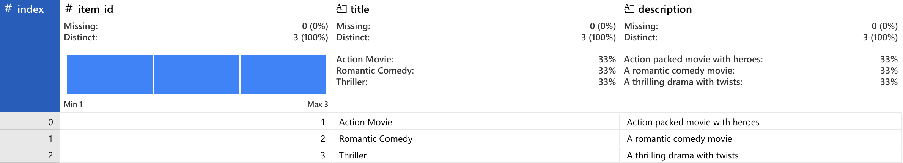
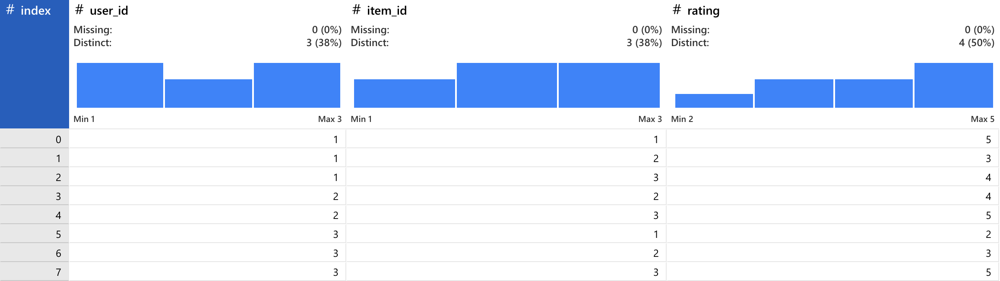
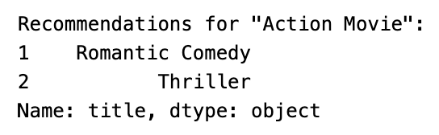
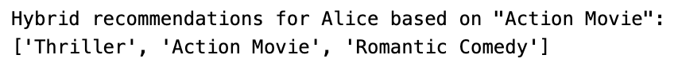

# Hybrid Movie Recommendation System

A comprehensive movie recommendation system using collaborative filtering (SVD) and content-based filtering (TF-IDF). Provides personalized recommendations based on user preferences and item descriptions.

## Features

- **Collaborative Filtering** using Singular Value Decomposition (SVD)
- **Content-Based Filtering** using TF-IDF vectorization and cosine similarity
- **Hybrid Recommendations** combining both collaborative and content-based approaches
- **User-Friendly Outputs** with real user names and movie titles

## Technologies Used

- 
- 
- 
- 
- 
- 
- 

## Setup and Installation

1. **Clone the repository**:

    ```
    git clone https://github.com/niladrridas/movieml.git
    cd movieml
    ```

2. **Create a virtual environment** (optional but recommended):

    ```
    python -m venv venv
    source venv/bin/activate  # On Windows use `venv\Scripts\activate`
    ```

3. **Install the required libraries**:

    ```
    pip install -r requirements.txt
    ```

## Usage

1. **Run Jupyter Notebook**:

    ```
    jupyter notebook
    ```

2. **Open the notebook**:
    - Navigate to `main_py.ipynb` and open it.

3. **Follow the steps in the notebook** to:
    - Load and preprocess the data
    - Train the collaborative filtering model using SVD
    - Generate content-based recommendations
    - Combine both methods in a hybrid recommendation system
    - Evaluate the models

## Project Structure

- `main_py.ipynb`: Jupyter Notebook containing the code and explanations
- `data/`: Directory to store datasets (users, movies, ratings)
- `requirements.txt`: List of required Python packages

## Example Outputs

1. **Data Loading and Preprocessing**:

    
    
    

2. **Collaborative Filtering with SVD**:

    

3. **Content-Based Filtering**:

    

4. **Hybrid Recommendation**:

    

## Contributing

Contributions are welcome! Please open an issue or submit a pull request for any improvements or bug fixes.

## License

This project is licensed under the MIT License. See the [LICENSE](https://github.com/niladrridas/movieml/blob/main/LICENSE) file for details.

### Instructions to Push Repository to GitHub Using VSCode

1. **Initialize Git in Your Project Directory**:
    - Open your project folder in VSCode.
    - Open the terminal in VSCode (`View` > `Terminal`).
    - Initialize a new Git repository:

    ```
    git init
    ```

2. **Add All Files to the Repository**:

    ```
    git add .
    ```

3. **Commit the Changes**:

    ```
    git commit -m "Initial commit"
    ```

4. **Create a New Repository on GitHub**:
    - Go to GitHub and create a new repository. Do not initialize it with a README, `.gitignore`, or license (since you already have these in your local repository).

5. **Add the Remote Repository URL**:
    - Copy the URL of the newly created GitHub repository.
    - Add it as a remote in your local Git repository:

    ```
    git remote add origin https://github.com/niladrridas/movieml.git
    ```

6. **Push the Local Repository to GitHub**:

    ```
    git push -u origin master
    ```
